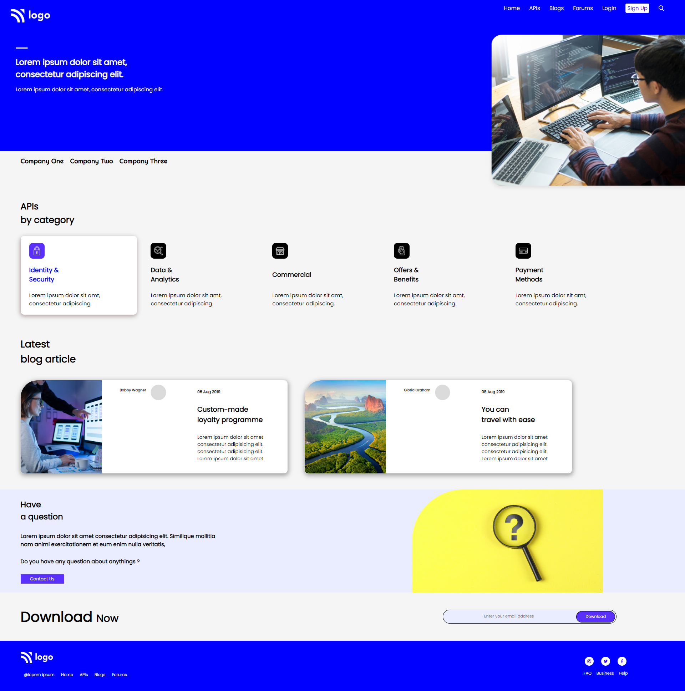

# Mohan Chindam

- I learned a new way to strategize things as it is a long web page.
- Used properties like flexbox, position, box-shadow, and some other flexbox properties, etc..,
- Polished my positioning skills, flexbox, sizing of elements, etc..,
- Used different ways to size and position elements rather than just hardcoding them and tried to generalize their values as much as possible.
- It took nearly four to four and half hours to complete this project.
- Enjoyed it a lot as I tried to design a page differently than usual.

- Below image shows the preview of the project:

I deployed the project on **Netlify**:
- You can preview the project here, [**Developer Landing Page**]()

